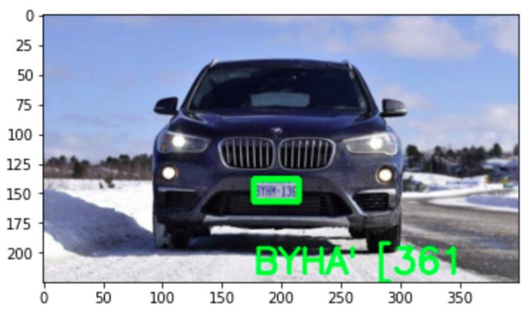

# Car Plate Recognition
This is a simple car plate recognition algorithm implemented in Python using the OpenCV and EasyOCR libraries.

## Installation
The EasyOCR library can be installed using pip:

```bash
!pip install easyocr
```

## Usage

1. Mount Google Drive and change the directory to the created directory:
```python
from google.colab import drive 
drive.mount("/content/gdrive")

%cd /content/gdrive/MyDrive/LicensePlateRecognition
```

2. Read the car image and convert it from BGR to gray scale:
```python

carImage = cv2.imread("/content/gdrive/MyDrive/LicensePlateRecognition/data/Cars25.png")
grayImage = cv2.cvtColor(carImage, cv2.COLOR_BGR2GRAY)

```

3. Apply bilateral filter for noise reduction and edge detection:
```python

keypoints = cv2.findContours(edged.copy(), cv2.RETR_TREE, cv2.CHAIN_APPROX_SIMPLE)
contours = imutils.grab_contours(keypoints)
contours = sorted(contours, key=cv2.contourArea, reverse=True)[:10]

```
4. Find the contours and sort them in descending order:
```python

keypoints = cv2.findContours(edged.copy(), cv2.RETR_TREE, cv2.CHAIN_APPROX_SIMPLE)
contours = imutils.grab_contours(keypoints)
contours = sorted(contours, key=cv2.contourArea, reverse=True)[:10]

```

5. Find the location of the car plate:
```python

location = None
for contour in contours:
    approx = cv2.approxPolyDP(contour, 10, True)
    if len(approx) == 4:
        location = approx
        break
```

6. Crop the car plate image and extract the text using EasyOCR:
```python
(x,y) = np.where(mask==255)
(x1, y1) = (np.min(x), np.min(y))
(x2, y2) = (np.max(x), np.max(y))
cropped_image = grayImage[x1:x2+1, y1:y2+1]

reader = easyocr.Reader(['en'])
result = reader.readtext(cropped_image)
text = result[0][-2]

```

7. Draw the bounding box and text on the original car image:
```python
font = cv2.FONT_HERSHEY_SIMPLEX
res = cv2.putText(carImage, text=text, org=(approx[0][0][0], approx[1][0][1]+60), fontFace=font, fontScale=1, color=(0,255,0), thickness=2, lineType=cv2.LINE_AA)
res = cv2.rectangle(carImage, tuple(approx[0][0]), tuple(approx[2][0]), (0,255,0),3)
```


8. Show the final result:
```python
plt.imshow(cv2.cvtColor(res, cv2.COLOR_BGR2RGB))
```

## Example
Example ouput



